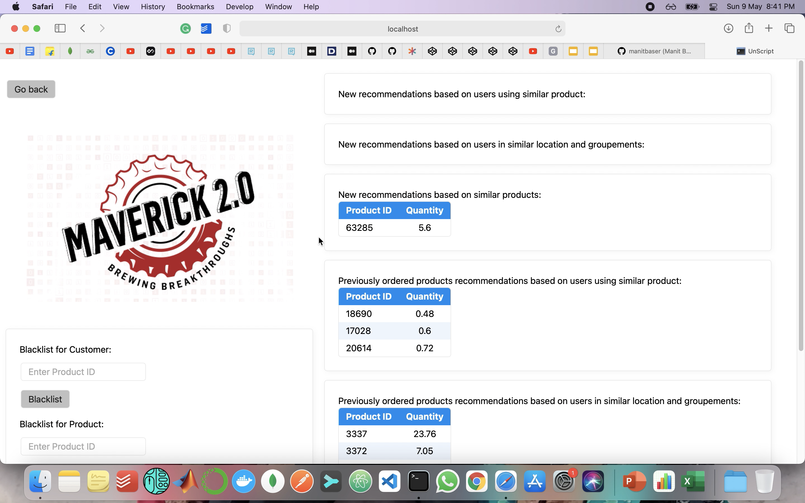

# Cross-Sell Up-Sell Recommender System
A recommender system that enables cross sell and upsell of products (either new products or already bought products) that will enable higher revenue generation. The data captures material that is sent to the wholesalers over a span of time.<br><br>
Link for the presentation - https://drive.google.com/file/d/1o8j2kPF_6vMz_LpxZn8uiZ_DAk83tkgU/view?usp=sharing<br><br>
Here is a video of the working of the platform. Click on it to get directed to the Google Drive link: 
[](https://drive.google.com/file/d/1n7JeZZ4E5O_HIuUbOQGvoNWYFVpzAHEV/view?usp=sharing)

## Objectives
* [x] Finding how similar other wholesalers are to W1.
* [x] Finding wholesalers who buy similar products.
* [x] Finding wholesalers who buy similar products.
* [x] Application of a feedback mechanism so that sales team can easily implement their knowledge of incompatible products/customer.
* [x] To find which products are popular.
* [x] To recommend the product which will enable higher revenue generation.


### The dataset
The dataset has been provided by AB InBev as a part of their hackathon Maverick 2.0: Hack-a-thon where the participants in the Cross-Sell Up-Sell track were to build a Recommender System based on the data given Consumers/Wholesalers and their history of purchase.

### Installation and setup

* Before starting the installation process, please ensure that you have conda/virtualenv installed.

1. Open terminal and clone the reposotory:

```bash
  git clone https://github.com/milonimittal/Cross_Sell-Up_Sell.git
 ```

2. Change into project directory:

```bash
  cd Cross_Sell-Up_Sell
```

3. Create python environment:

```bash
  conda create --name recsys python=3.8.5
```

4. Activate environment:
        
```bash
   conda activate recsys
```

5. Install dependencies:

```bash
   pip install -r requirements.txt
```  

6. Running the code:

```bash
   python main_flask.py
```  


## Contributing
Feel free to contribute features / point out errors. Fork this repository and make a pull request.  
